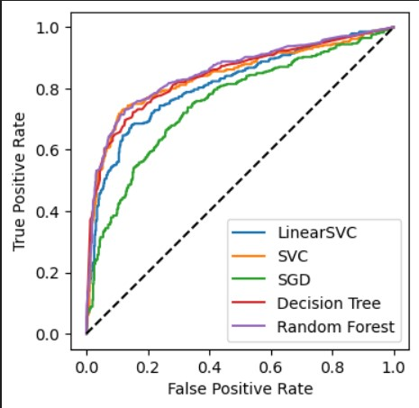

# Titanic Challenge

## Challenge Description

The challenge consists of applying machine learning to create a prediction model capable of discerning which passengers survived the Titanic's shipwreck. It is a classical problem of binary classification, since uses a training set with labels for survivors and deceased passengers.

## Goals
The challenge's primary goal rest on the development of a end-to-end machine learning project. Therefore, the project encompasses Preprocessing, Exploratory Data Analysis (EDA), Selecting models, and Tuning Hyperparameters. All of these, using libraries such as Scikit-learning, Pandas, Numpy, Matplotlib, and Seaborn.

## Solution Strategy
The project's methodological path took follows the steps described below:
-Data Cleaning: Evaluation and cleaning of missing values and outliers from the dataset;
-Exploratory Data Analysis: Identification and evaluation of the attributes correlated to the survival of the passengers;
-Preprocessing: Encoding of categorical attributes and scaling of numerical attributes.
-Model Selection: Testing of different models reckoning metrics for classification.
-Hyperparameter optimization: Testing of different configurations of parameters, towards the discovery of the best model.
-Predictions on the Test Set: Test set classification by the final model.

## Insights from EDA
- Women had a greater percentage of survivals;
- The third class of the ship had the highest percentage of deceased;

## Machine learning models performance
| Model | Accuracy | AUC score | F1 score
| ------- | ------- |------- |------- |
| SVC | 0.825677 | 0.839334 | 0.758190 |
| Random Forest| 0.813317 | 0.852638 | 0.750000 |
| Decision Tree| 0.806512 | 0.842618 | 0.733746 |
| LinearSVC| 0.786249 | 0.812547 | 0.708589 |
| SGD| 0.717735 | 0.752229 | 0.613251 |

  

## Results

The final prediction on the test set had a score of 0.77272 which is slightly greater than the sample available for comparison on the kaggle website (0.76555).
